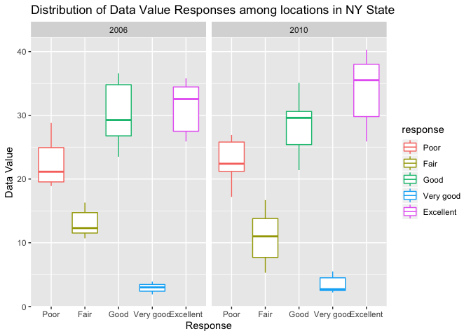

p8105\_hw3\_nja2140
================

Problem 1: Instacart Data. Load the data from the p8105.datasets. Write
a short description of the dataset, noting the size and structure of the
data, describing some key variables, and giving illustrative examples of
observations

``` r
data("instacart") 
instacart
```

    ## # A tibble: 1,384,617 x 15
    ##    order_id product_id add_to_cart_ord… reordered user_id eval_set
    ##       <int>      <int>            <int>     <int>   <int> <chr>   
    ##  1        1      49302                1         1  112108 train   
    ##  2        1      11109                2         1  112108 train   
    ##  3        1      10246                3         0  112108 train   
    ##  4        1      49683                4         0  112108 train   
    ##  5        1      43633                5         1  112108 train   
    ##  6        1      13176                6         0  112108 train   
    ##  7        1      47209                7         0  112108 train   
    ##  8        1      22035                8         1  112108 train   
    ##  9       36      39612                1         0   79431 train   
    ## 10       36      19660                2         1   79431 train   
    ## # … with 1,384,607 more rows, and 9 more variables: order_number <int>,
    ## #   order_dow <int>, order_hour_of_day <int>,
    ## #   days_since_prior_order <int>, product_name <chr>, aisle_id <int>,
    ## #   department_id <int>, aisle <chr>, department <chr>

The size of the dataset `Instacart` is 1384617 observtaions and 15
variables. Key variables include all associated details of the order and
the product acquired. The mean hour of day where orders were made is
13.5775922. Te median number of days between orders is 15

Answer the following (commenting on the results of each): -How many
aisles are there, and which aisles are the most items ordered from?

\-Make a plot that shows the number of items ordered in each aisle,
limiting this to aisles with more than 10000 items ordered. Arrange
aisles sensibly, and organize your plot so others can read it.

\-Make a table showing the three most popular items in each of the
aisles “baking ingredients”, “dog food care”, and “packaged vegetables
fruits”. Include the number of times each item is ordered in your table.

\-Make a table showing the mean hour of the day at which Pink Lady
Apples and Coffee Ice Cream are ordered on each day of the week; format
this table for human readers (i.e. produce a 2 x 7 table)

``` r
instacart_one=instacart %>%
  janitor::clean_names() %>%
  group_by(aisle_id, aisle) %>%
  summarize(n = n()) %>%
  arrange(desc(n))
instacart_one
```

    ## # A tibble: 134 x 3
    ## # Groups:   aisle_id [134]
    ##    aisle_id aisle                              n
    ##       <int> <chr>                          <int>
    ##  1       83 fresh vegetables              150609
    ##  2       24 fresh fruits                  150473
    ##  3      123 packaged vegetables fruits     78493
    ##  4      120 yogurt                         55240
    ##  5       21 packaged cheese                41699
    ##  6      115 water seltzer sparkling water  36617
    ##  7       84 milk                           32644
    ##  8      107 chips pretzels                 31269
    ##  9       91 soy lactosefree                26240
    ## 10      112 bread                          23635
    ## # … with 124 more rows

There are 134 aisles. Aisle 83, 24, 123 and 120 are where the most items
were ordered from.

``` r
aisle_scatter=
  filter(instacart_one, n> 10000)
  ggplot(aisle_scatter, aes(x = reorder(aisle, -n), y =n)) +
  geom_point(color = "turquoise") +
  theme(
    axis.text.x = element_text(angle = 90, hjust = 1), 
    axis.text = element_text(size = 7.5)) +
  labs(
    title = "Number of items ordered in each aisle",
    x = "Aisle",
    y = "Number of products"
  )
```

<!-- -->

``` r
insta_table=instacart %>%
  filter(aisle == "baking ingredients" | 
         aisle == "dog food care" | 
         aisle == "packaged vegetables fruits") %>%
  group_by(aisle, product_name) %>%
  summarize(n = n()) %>%
  top_n(3) %>%
  arrange(desc(n)) %>%
  knitr::kable ()
```

    ## Selecting by n

``` r
insta_table
```

| aisle                      | product\_name                                 |    n |
| :------------------------- | :-------------------------------------------- | ---: |
| packaged vegetables fruits | Organic Baby Spinach                          | 9784 |
| packaged vegetables fruits | Organic Raspberries                           | 5546 |
| packaged vegetables fruits | Organic Blueberries                           | 4966 |
| baking ingredients         | Light Brown Sugar                             |  499 |
| baking ingredients         | Pure Baking Soda                              |  387 |
| baking ingredients         | Cane Sugar                                    |  336 |
| dog food care              | Snack Sticks Chicken & Rice Recipe Dog Treats |   30 |
| dog food care              | Organix Chicken & Brown Rice Recipe           |   28 |
| dog food care              | Small Dog Biscuits                            |   26 |

``` r
insta_table2=instacart %>%
  filter(product_name == "Pink Lady Apples" | 
         product_name == "Coffee Ice Cream") %>%
  group_by(product_name, order_dow) %>%
  summarize(mean_order_hour= mean(order_hour_of_day)) %>%
  select(product_name, order_dow, mean_order_hour) %>%
  pivot_wider(
    names_from = order_dow,
    values_from = mean_order_hour
  ) %>%
  knitr::kable ()
insta_table2
```

| product\_name    |        0 |        1 |        2 |        3 |        4 |        5 |        6 |
| :--------------- | -------: | -------: | -------: | -------: | -------: | -------: | -------: |
| Coffee Ice Cream | 13.77419 | 14.31579 | 15.38095 | 15.31818 | 15.21739 | 12.26316 | 13.83333 |
| Pink Lady Apples | 13.44118 | 11.36000 | 11.70213 | 14.25000 | 11.55172 | 12.78431 | 11.93750 |

Problem 2: Load the BRFSS data. First, do some data cleaning: -Format
the data to use appropriate variable names; -Focus on the “Overall
Health” topic -Include only responses from “Excellent” to “Poor”
-Organize responses as a factor taking levels ordered from “Poor” to
“Excellent”

``` r
data("brfss_smart2010")
brfss_smart2010
```

    ## # A tibble: 134,203 x 23
    ##     Year Locationabbr Locationdesc Class Topic Question Response
    ##    <int> <chr>        <chr>        <chr> <chr> <chr>    <chr>   
    ##  1  2010 AL           AL - Jeffer… Heal… Over… How is … Excelle…
    ##  2  2010 AL           AL - Jeffer… Heal… Over… How is … Very go…
    ##  3  2010 AL           AL - Jeffer… Heal… Over… How is … Good    
    ##  4  2010 AL           AL - Jeffer… Heal… Over… How is … Fair    
    ##  5  2010 AL           AL - Jeffer… Heal… Over… How is … Poor    
    ##  6  2010 AL           AL - Jeffer… Heal… Fair… Health … Good or…
    ##  7  2010 AL           AL - Jeffer… Heal… Fair… Health … Fair or…
    ##  8  2010 AL           AL - Jeffer… Heal… Heal… Do you … Yes     
    ##  9  2010 AL           AL - Jeffer… Heal… Heal… Do you … No      
    ## 10  2010 AL           AL - Jeffer… Heal… Unde… Adults … Yes     
    ## # … with 134,193 more rows, and 16 more variables: Sample_Size <int>,
    ## #   Data_value <dbl>, Confidence_limit_Low <dbl>,
    ## #   Confidence_limit_High <dbl>, Display_order <int>,
    ## #   Data_value_unit <chr>, Data_value_type <chr>,
    ## #   Data_Value_Footnote_Symbol <chr>, Data_Value_Footnote <chr>,
    ## #   DataSource <chr>, ClassId <chr>, TopicId <chr>, LocationID <chr>,
    ## #   QuestionID <chr>, RESPID <chr>, GeoLocation <chr>

``` r
brfss_new=brfss_smart2010 %>%
  janitor::clean_names() %>%
  filter(topic == "Overall Health", 
         response == "Excellent" | 
         response == "Very good" | 
         response == "Good"| 
         response == "Fair"|
         response == "Poor") %>%
  mutate(response = factor(response, labels = c("Poor","Fair","Good","Very good", "Excellent" ))) %>%
  select(-location_id, -data_value_footnote_symbol, -data_value_footnote)
brfss_new
```

    ## # A tibble: 10,625 x 20
    ##     year locationabbr locationdesc class topic question response
    ##    <int> <chr>        <chr>        <chr> <chr> <chr>    <fct>   
    ##  1  2010 AL           AL - Jeffer… Heal… Over… How is … Poor    
    ##  2  2010 AL           AL - Jeffer… Heal… Over… How is … Excelle…
    ##  3  2010 AL           AL - Jeffer… Heal… Over… How is … Good    
    ##  4  2010 AL           AL - Jeffer… Heal… Over… How is … Fair    
    ##  5  2010 AL           AL - Jeffer… Heal… Over… How is … Very go…
    ##  6  2010 AL           AL - Mobile… Heal… Over… How is … Poor    
    ##  7  2010 AL           AL - Mobile… Heal… Over… How is … Excelle…
    ##  8  2010 AL           AL - Mobile… Heal… Over… How is … Good    
    ##  9  2010 AL           AL - Mobile… Heal… Over… How is … Fair    
    ## 10  2010 AL           AL - Mobile… Heal… Over… How is … Very go…
    ## # … with 10,615 more rows, and 13 more variables: sample_size <int>,
    ## #   data_value <dbl>, confidence_limit_low <dbl>,
    ## #   confidence_limit_high <dbl>, display_order <int>,
    ## #   data_value_unit <chr>, data_value_type <chr>, data_source <chr>,
    ## #   class_id <chr>, topic_id <chr>, question_id <chr>, respid <chr>,
    ## #   geo_location <chr>

\-In 2002, which states were observed at 7 or more locations? What about
in 2010? -Construct a dataset that is limited to Excellent responses,
and contains, year, state, and a variable that averages the data\_value
across locations within a state. Make a “spaghetti” plot of this average
value over time within a state (that is, make a plot showing a line for
each state across years – the geom\_line geometry and group aesthetic
will help). -Make a two-panel plot showing, for the years 2006, and
2010, distribution of data\_value for responses (“Poor” to “Excellent”)
among locations in NY State

``` r
brfss_new %>%
  filter(year == "2002") %>%
  group_by(locationabbr) %>%
  summarize(
    n_locations = n_distinct(geo_location)) %>%
  filter(n_locations>6) %>%
  arrange(desc(n_locations)) 
```

    ## # A tibble: 6 x 2
    ##   locationabbr n_locations
    ##   <chr>              <int>
    ## 1 PA                    10
    ## 2 MA                     8
    ## 3 NJ                     8
    ## 4 CT                     7
    ## 5 FL                     7
    ## 6 NC                     7

The states that were observed at 7 or more locations in 2002 are PA, MA,
NJ, CT, FL, NC.

``` r
brfss_new %>%
  filter(year == "2010") %>%
  group_by(locationabbr) %>%
  summarize(
    n_locations = n_distinct(geo_location)) %>%
  filter(n_locations>6) %>%
  arrange(desc(n_locations)) 
```

    ## # A tibble: 14 x 2
    ##    locationabbr n_locations
    ##    <chr>              <int>
    ##  1 FL                    41
    ##  2 NJ                    19
    ##  3 TX                    16
    ##  4 CA                    12
    ##  5 MD                    12
    ##  6 NC                    12
    ##  7 NE                    10
    ##  8 WA                    10
    ##  9 MA                     9
    ## 10 NY                     9
    ## 11 OH                     8
    ## 12 CO                     7
    ## 13 PA                     7
    ## 14 SC                     7

The states that were observed at 7 or more locations in 2010 are FL, NJ,
TX, CA, MD, NC, NE, WA, MA, NY, OH, CO, PA, SC.

``` r
brfss_two=brfss_new %>%
  filter(response == "Excellent") %>%
  group_by(year, locationabbr) %>%
  summarize(avg_data_value = mean(data_value, na.rm = TRUE)) %>%
  select(year, locationabbr, avg_data_value) 
brfss_two
```

    ## # A tibble: 443 x 3
    ## # Groups:   year [9]
    ##     year locationabbr avg_data_value
    ##    <int> <chr>                 <dbl>
    ##  1  2002 AK                     33.7
    ##  2  2002 AL                     30.9
    ##  3  2002 AR                     29.3
    ##  4  2002 AZ                     33.4
    ##  5  2002 CA                     29.8
    ##  6  2002 CO                     32.5
    ##  7  2002 CT                     33.8
    ##  8  2002 DC                     31.8
    ##  9  2002 DE                     34.2
    ## 10  2002 FL                     31.1
    ## # … with 433 more rows

``` r
brfss_spaghetti=
  brfss_two %>%
  ggplot(aes(x = year, y= avg_data_value, group = locationabbr)) +
  geom_line(aes(color = locationabbr)) +
  labs(
    title = "Average value over time within the 50 states",
    x = "Year",
    y = "Average Data Value"
  )
brfss_spaghetti
```

<!-- -->

``` r
brfss_three=brfss_new %>%
  filter(topic == "Overall Health" | 
         response == "Excellent" | 
         response == "Very good" | 
         response == "Good"| 
         response == "Fair"|
         response == "Poor",
         year == "2006"| 
         year == "2010" ,
         locationabbr == "NY")  
brfss_three
```

    ## # A tibble: 75 x 20
    ##     year locationabbr locationdesc class topic question response
    ##    <int> <chr>        <chr>        <chr> <chr> <chr>    <fct>   
    ##  1  2010 NY           NY - Bronx … Heal… Over… How is … Poor    
    ##  2  2010 NY           NY - Bronx … Heal… Over… How is … Excelle…
    ##  3  2010 NY           NY - Bronx … Heal… Over… How is … Good    
    ##  4  2010 NY           NY - Bronx … Heal… Over… How is … Fair    
    ##  5  2010 NY           NY - Bronx … Heal… Over… How is … Very go…
    ##  6  2010 NY           NY - Erie C… Heal… Over… How is … Poor    
    ##  7  2010 NY           NY - Erie C… Heal… Over… How is … Excelle…
    ##  8  2010 NY           NY - Erie C… Heal… Over… How is … Good    
    ##  9  2010 NY           NY - Erie C… Heal… Over… How is … Fair    
    ## 10  2010 NY           NY - Erie C… Heal… Over… How is … Very go…
    ## # … with 65 more rows, and 13 more variables: sample_size <int>,
    ## #   data_value <dbl>, confidence_limit_low <dbl>,
    ## #   confidence_limit_high <dbl>, display_order <int>,
    ## #   data_value_unit <chr>, data_value_type <chr>, data_source <chr>,
    ## #   class_id <chr>, topic_id <chr>, question_id <chr>, respid <chr>,
    ## #   geo_location <chr>

``` r
two_dv=
  brfss_three %>%
  ggplot(aes(x = response, y = data_value, color = year)) +
  geom_point() +
  facet_grid(. ~year)
two_dv
```

<!-- -->
